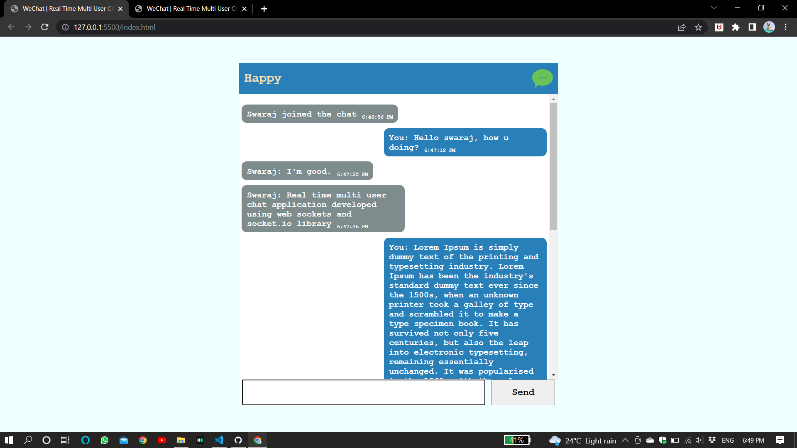

# WeChat
Real time multi user chat application developed using web socket protocol and socket.io library

## Prerequisites
	A socket is an end-point in a multi way communication channel.
	WS & WSS

## Upcoming Updates

<strike>timestamp of messages</strike>  
one-to-one encryption

## HTTP
	one way communication at a time
	client requests and then the server responds 
	HTTP & HTTPS

## Web Sockets 
	protocol that allows multiway communication simultaneously
	clients and server both can push updates simultaneously that makes the web app quite efficient 
	WS & WSS

## Socker.IO
	event driven JS library for developing real time web application
	https://socket.io/

# UI Design

### User 1

### User 2

	Description of above image: Two instances of clients are served which are connected to one server instance and are efficiently able to communicate.
